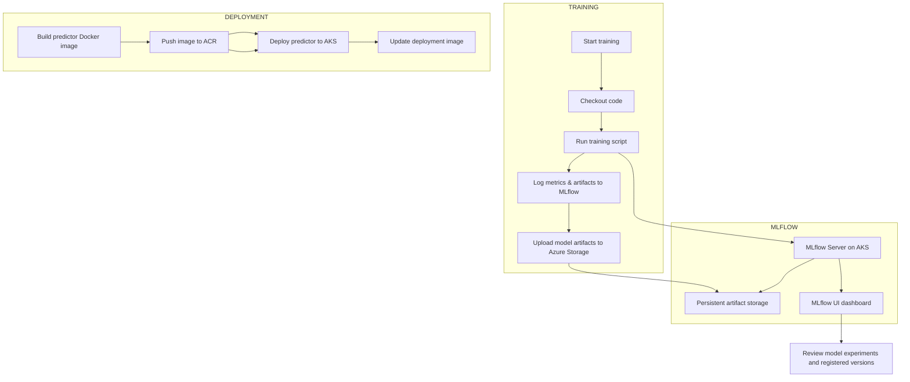

# Chai Sutta Predictor MLFlow Production Architecture

## Overview

This repository contains a production-ready machine learning deployment pipeline for the `chai-sutta-predictor` application. It includes:

- ML model training and tracking with MLflow
- Azure infrastructure provisioning using Terraform
- Kubernetes deployment manifests for model serving
- GitHub Actions workflows for CI/CD and deployment

## Repository Structure

- `chai-sutta-modal-mlflow/`
  - `src/` — application and training code
  - `mlflow-server/` — MLflow server Docker build context
  - `requirements.txt` — Python dependencies
- `kubernetes/`
  - `mlflowserver/` — MLflow server deployment and service manifest
  - `model/` — predictor deployment and service manifest
- `terraform-k8/`
  - `child_module/` — reusable Azure infrastructure resources
  - `root_module/` — Terraform root module and backend configuration
- `.github/workflows/` — GitHub Actions pipelines for infrastructure, training, and application deployment

## Key Components

### MLflow Server

- Deploys an MLflow tracking server on AKS
- Uses Azure Storage Account for remote artifact storage
- Exposes MLflow UI via a LoadBalancer service

### Predictor Service

- Builds a Docker image for the predictor API
- Deploys the model service to AKS
- Uses image tags and model versioning for production delivery

### Terraform Infrastructure

- Creates Azure Resource Group
- Creates Azure Storage Account and private container
- Creates Azure Container Registry (ACR)
- Deploys Azure Kubernetes Service (AKS)

### CI/CD Workflows

- `1.mlflowserver_pipeline.yaml` — build and deploy MLflow server
- `2.modal_train_pipeline.yaml` — train model, archive artifacts, upload to Azure Storage
- `3.chai-sutta-predictor-deploy.yaml` — build predictor image, deploy to AKS, and update service
- `terraform_cicd.yaml` — Terraform init, fmt, validate, plan, and apply for infrastructure

## System Flow

Below is the high-level production flow for training, tracking, and deployment.


```

## Deployment and Usage

### 1. Provision Infrastructure

From `terraform-k8/root_module/`:

```bash
terraform init
terraform fmt -recursive
terraform validate
terraform plan
terraform apply -auto-approve
```

### 2. Deploy MLflow Server

Use the GitHub workflow `1.mlflowserver_pipeline.yaml` or run the same steps locally:

```bash
az login
az acr login --name <registry-name>
az aks get-credentials --resource-group <rg> --name <aks-cluster>
kubectl apply -f kubernetes/mlflowserver/deployment.yaml
kubectl apply -f kubernetes/mlflowserver/service.yaml
```


### 3. Train Model

Use the GitHub workflow `2.modal_train_pipeline.yaml` to execute training and upload artifacts. The workflow sets:

- `MODEL_VERSION`
- `MLFLOW_TRACKING_URI`

### 4. Deploy Predictor

Use the GitHub workflow `3.chai-sutta-predictor-deploy.yaml` to:

- download model artifacts from Azure Storage
- build and push Docker image
- deploy and update the AKS deployment

## Naming Conventions

This repository uses consistent production names across CI, Kubernetes, and Terraform:

- Azure resources: `rg-chai-sutta-prod`, `aks-chai-sutta-prod`, `chaisuttaprodacr`, `chaisuttaprodsa`
- Kubernetes resources: `chai-sutta-mlflow-server`, `chai-sutta-mlflow-server-service`, `chaisutta-predictor`, `chaisutta-predictor-service`
- Docker images: `chaisuttaprodacr.azurecr.io/chaisutta-mlflow-server`, `chaisuttaprodacr.azurecr.io/chaisutta-predictor`

## Best Practices

- Keep secrets out of source control and use GitHub Secrets for Azure credentials.
- Use versioned Docker image tags for production deployments.
- Store experiments and artifacts in MLflow remote storage.
- Monitor AKS service health and rollout status after deployment.

## Notes

- Update Azure subscription, resource group, and registry names in workflows and Terraform variables before deploying.
- Ensure `az` CLI and `kubectl` are installed and configured for the target subscription.
- Confirm the MLflow UI service is reachable before running training pipelines.
